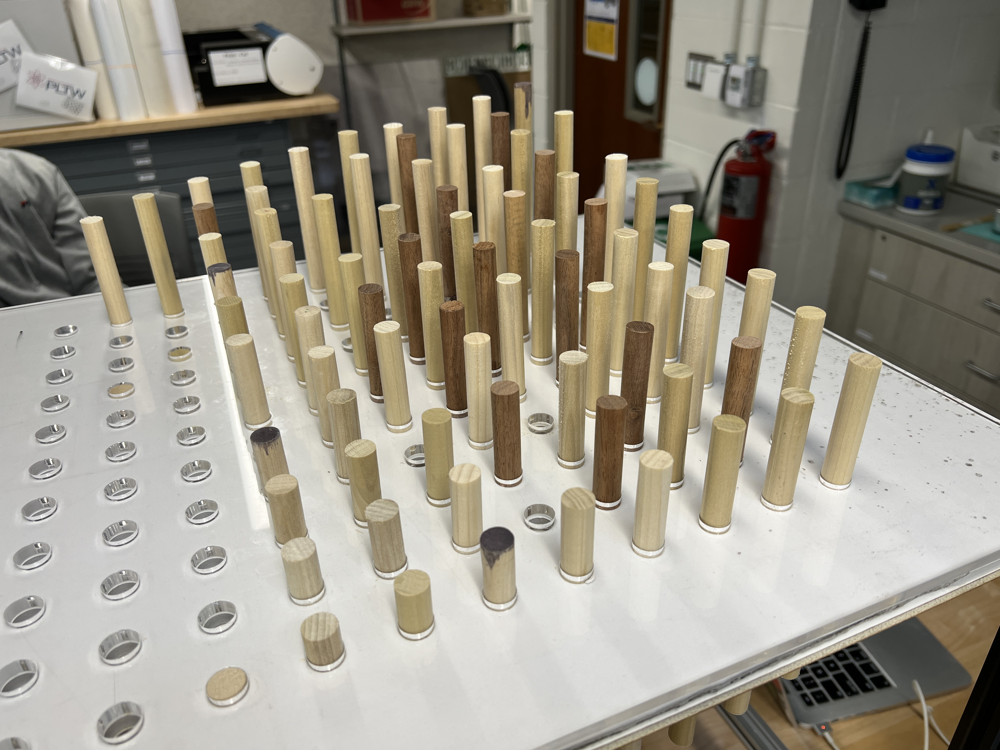
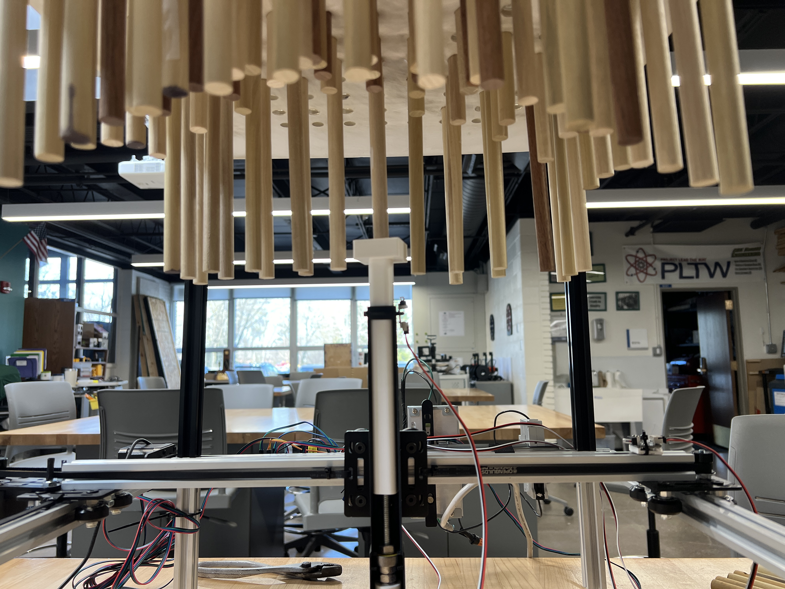
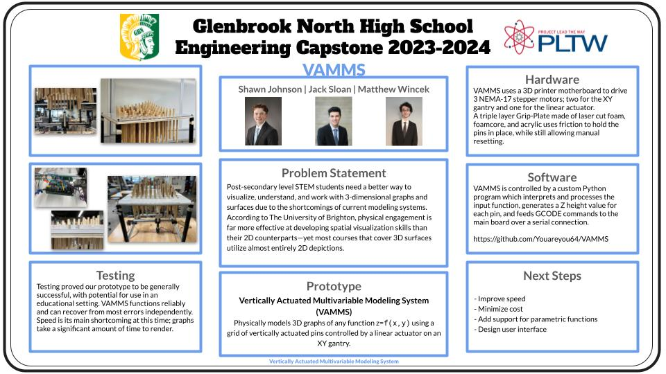

# VAMMS - Vertically Actuated Multivariable Modeling System

A Project Lead the Way (PLTW) Engineering Development and Design project by 
**[Jack Sloan](https://github.com/Youareyou64), [Shawn Johnson](https://github.com/sjohnson1512), 
and Matthew Wincek**.

## What is VAMMS?

VAMMS physically models 3D graphs of (almost) any function `z=f(x,y)` using a grid of vertically actuated pins
controlled by a linear actuator on an XY gantry. VAMMS is designed for educational use to help students overcome the
difficulties associated with visualizing in 3 dimensions. 

VAMMS is designed to be a superior alternative to digital solutions for visualizing 3-dimensional graphs and surfaces. 

## Hardware

VAMMS uses a repurposed SKR Mini e3 v3 board to drive 3 NEMA-17 stepper motors; two for the XY gantry and one for the
linear actuator. 

A 3-layer "grip plate" made of laser cut foam, foamcore, and acrylic, holds the pins in place while allowing manual
resetting.

## Software

The software in this repository interfaces with the mainboard running custom Marlin firmware, and feeds generated GCODE
commands to be executed. 

## Contact

[Jack Sloan](https://www.linkedin.com/in/jack-sloan-1378b330b/) (2024) — jackasloan@gmail.com 

Shawn Johnson (2024) — johnson.28614@gmail.com  

Matthew Wincek (2025) — matthew.wincek@gmail.com 

